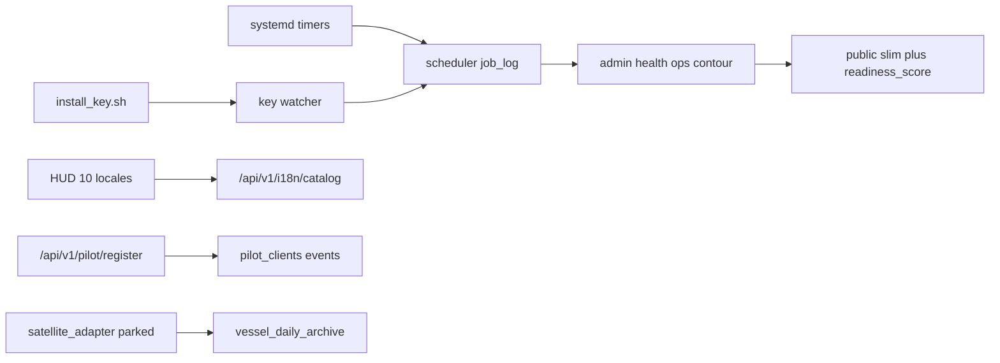

# Sentinel release notes v2.0

Contract remains `1.8.0-ops-gis-sot`. Dual Gate numbers are unchanged: LIMITED 5, FULL 100, fleet-wide N 30, lag 300 s, disk 20% / 10%. `fully_commissioned_at` stays `2026-09-25T11:40:20Z`.

The readiness score can reach 100 only when every measured channel has real rows. A parked provider adds 0.

## Architecture

SQLite WAL is the live store. Timescale and a second read replica are runbooks (`docs/timescale_migration_runbook.md`, `docs/replica_runbook.md`), not a migration.

## Endpoints

| Endpoint | Auth |
|---|---|
| `GET /api/v1/health` | Public slim, plus `readiness_score` |
| `GET /api/v1/health` with admin key | Full document, including `ops` and `disk_forecast` |
| `GET /api/v1/ops/daily` | `X-API-Key`, admin or readonly |
| `GET /api/v1/i18n/catalog` | Public |
| `POST /api/v1/pilot/register` | Public, 10 req/min per IP |

## Invariants

Publish still blocks only when `pipeline_health_status` is not NOMINAL. Fleet sample stays informational. Synthetic payloads still require `is_synthetic=true`. Archive gaps stay `source=none`. Secrets in health and logs stay masked to `****last4`. LLM output and the readiness formula do not change Dual Gate status.

## Operations left to a person

- `bash scripts/install_key.sh` for VesselFinder, Anthropic, and the alert webhook if a receiver is wanted. Satellite uses the same script with `SATELLITE` plus `SAT_PROVIDER` in `.env`.
- `scripts/gen_api_key.sh` when an operator key is needed outside the pilot register.
- Bake: `python deploy_sentinel.py --bake-image --use-cache` (the repository entry point). The node script waits for container health, regenerates the manifest, then smokes routes with retries.
- Read `GET /api/v1/ops/daily`.

## Known limits

VesselFinder and satellite AIS are external contracts. Without those keys the adapters stay paused or parked and make no calls. Terrestrial coverage remains the G3 ceiling. The single xfail in pytest is that live satellite/VF activation, marked `strict=True`.
